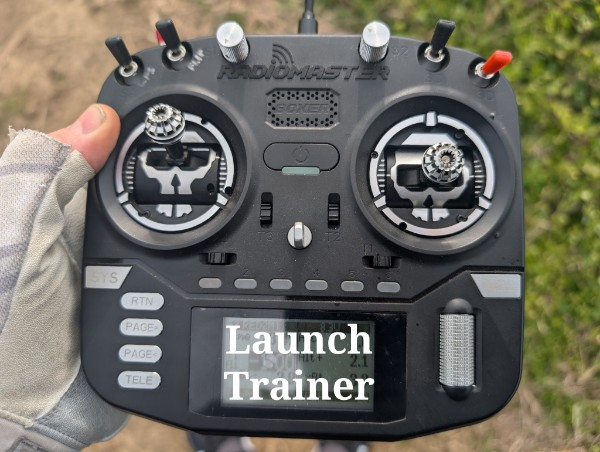
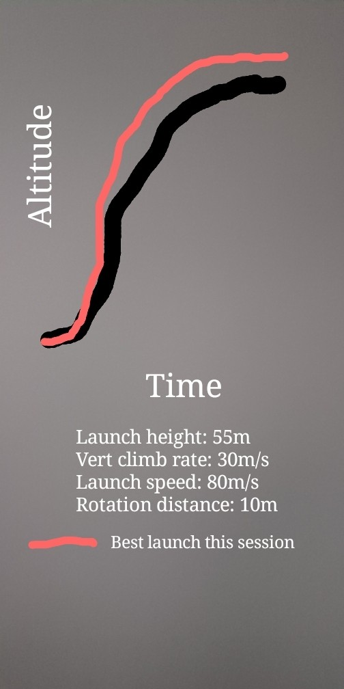

# LaunchTrainer lua script

This is a work-in-progress as the request of my friend Adam who is big into RC glider competition.
This is (will be) a lua script that measure's one's hand launch performance through multiple stats such as:
  - launch height
  - vertical climb rate
  - launch speed
  - rotation distance

