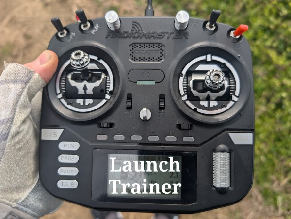
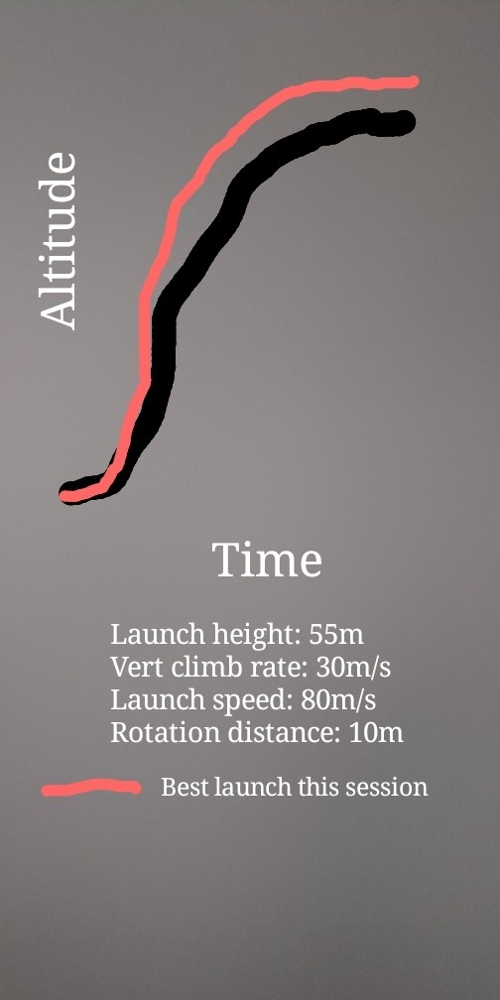

# LaunchTrainer



LaunchTrainer is an early-stage project for evaluating RC launch performance. The current `v0` is an offline Python analyzer that reads telemetry CSV logs, auto-detects the strongest launch-like event, and reports provisional launch metrics. The longer-term target is still an EdgeTX Lua script, but this repository now starts by proving the metric logic against recorded logs.

## Current V0 Scope

The analyzer currently reports:

- `launch_height_m`
- `time_to_apex_s`
- `max_climb_rate_mps`

It also emits confidence and warning messages when the telemetry looks unlike a hand-launch glider log. The current sample fixture is treated as a schema example, not as trusted glider-launch ground truth.



## Usage

Analyze a telemetry file:

```bash
python3 -m launchtrainer analyze tests/Timber-2024-11-09-162030.csv
```

Write structured JSON alongside the CLI summary:

```bash
python3 -m launchtrainer analyze tests/Timber-2024-11-09-162030.csv --json-out result.json
```

The analyzer expects the current telemetry schema to contain these columns:

- `Time`
- `GAlt(m)`
- `GSpd(kmh)`
- `AccX(g)`, `AccY(g)`, `AccZ(g)`
- `GYRX(°)`, `GYRY(°)`, `GYRZ(°)`
- `ETHR(%)`
- `FM`

## Output Contract

Successful analysis returns a compact CLI summary and, when `--json-out` is provided, a JSON payload shaped like this:

```json
{
  "source_file": "string",
  "status": "ok|warning|error",
  "detection": {
    "method": "auto_v1",
    "confidence": "high|medium|low",
    "start_time_s": 0.0,
    "end_time_s": 0.0,
    "sample_period_s": 0.0
  },
  "metrics": {
    "launch_height_m": 0.0,
    "time_to_apex_s": 0.0,
    "max_climb_rate_mps": 0.0
  },
  "warnings": ["string"]
}
```

## Detection Notes

`v0` uses a deterministic `auto_v1` heuristic:

- Estimate sample period from the telemetry timestamps.
- Warn when cadence is slower than `0.25 s`.
- Smooth altitude with a 3-sample moving average.
- Score candidate windows from `2 s` to `8 s`.
- Favor altitude gain, speed gain, and launch-like accel or gyro onset.
- Penalize sustained throttle so powered-flight logs are marked provisional instead of hard-rejected.

This first implementation is intentionally conservative. It is designed to be portable to EdgeTX Lua later, not to claim final launch-detection accuracy yet.

## Tests

Run the current standard-library test suite with:

```bash
python3 -m unittest discover -s tests -p 'test_*.py'
```

## Limitations

- The current parser is fixed to the sample telemetry column names.
- `launch_speed` and `rotation_distance` are intentionally deferred.
- The included fixture appears to be powered-flight telemetry, so warnings and low-confidence output are expected.
- Representative hand-launch glider logs are still needed before tuning the final algorithm.
